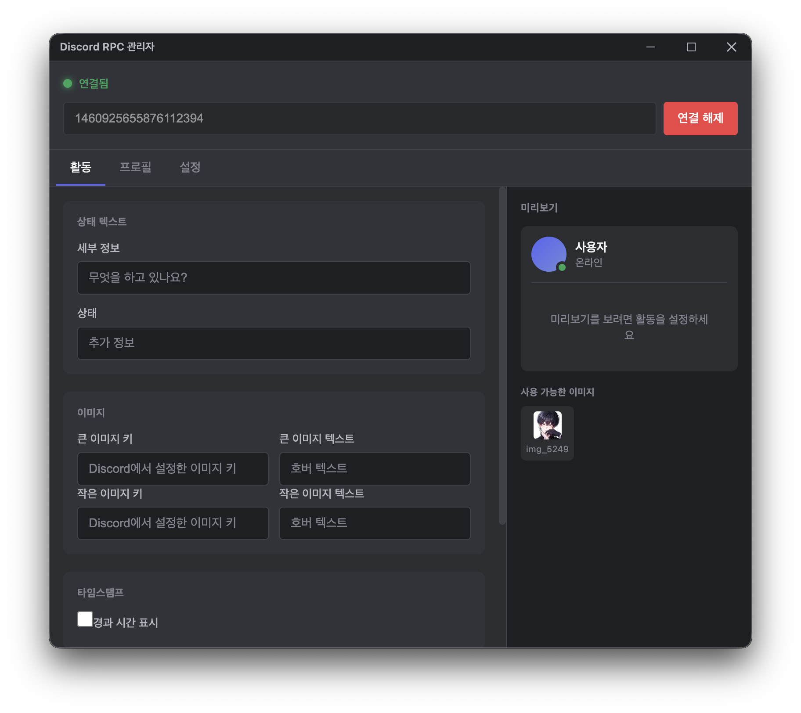

# Discord RPC Manager

<p align="center">
  
</p>

<p align="center">
  <b>Discord Rich Presence를 쉽게 커스터마이즈하세요</b>
</p>

<p align="center">
  
  
  
</p>

---

## 주요 기능

- **커스텀 상태 표시** - Details, State, 이미지, 버튼 등 자유롭게 설정
- **실시간 미리보기** - Discord에 표시될 모습을 바로 확인
- **프로필 저장** - 여러 설정을 프로필로 저장하고 불러오기
- **시스템 트레이** - 백그라운드에서 실행
- **자동 시작** - Windows/macOS 시작 시 자동 실행
- **다국어 지원** - 한국어, English

## 스크린샷

<p align="center">
  
</p>

## 설치

### 다운로드

[Releases](https://github.com/yourusername/discord-rpc-manager/releases) 페이지에서 최신 버전을 다운로드하세요.

- **Windows**: `.exe` (설치형) 또는 `.portable.exe` (포터블)
- **macOS**: `.dmg` 또는 `.zip`

### 직접 빌드

```bash
# 저장소 클론
git clone https://github.com/yourusername/discord-rpc-manager.git
cd discord-rpc-manager

# 의존성 설치
npm install

# 개발 모드 실행
npm run electron:dev

# 프로덕션 빌드
npm run dist          # 현재 플랫폼
npm run dist:win      # Windows
npm run dist -- --mac # macOS
```

## 사용법

### 1. Discord 애플리케이션 생성

1. [Discord Developer Portal](https://discord.com/developers/applications)에 접속
2. "New Application" 클릭
3. 애플리케이션 이름 입력 (Discord 상태에 표시될 이름)
4. "Rich Presence" > "Art Assets"에서 이미지 업로드 (선택)
5. "General Information"에서 **Application ID** 복사

### 2. 앱 연결

1. Discord RPC Manager 실행
2. 복사한 Application ID를 Client ID 필드에 붙여넣기
3. "Connect" 버튼 클릭

### 3. 상태 설정

- **Details**: 첫 번째 줄 텍스트
- **State**: 두 번째 줄 텍스트  
- **Large/Small Image**: Discord Developer Portal에서 업로드한 이미지 키
- **Buttons**: 최대 2개 (본인에게는 보이지 않음)
- **Timestamp**: 경과 시간 표시

## 기술 스택

- **Electron** - 크로스 플랫폼 데스크톱 앱
- **React** - UI 프레임워크
- **TypeScript** - 타입 안전성
- **Vite** - 빠른 빌드 도구
- **discord-rpc** - Discord RPC 연결
- **electron-store** - 설정 저장
- **i18next** - 다국어 지원

## 프로젝트 구조

```
src/
├── main/                 # Electron 메인 프로세스
│   ├── main.ts          # 윈도우, 트레이, IPC
│   ├── preload.ts       # Context Bridge
│   ├── discord-rpc.ts   # Discord RPC 서비스
│   └── store.ts         # 설정 저장소
│
└── renderer/            # React 렌더러
    ├── App.tsx          # 메인 앱
    ├── components/      # UI 컴포넌트
    ├── styles/          # CSS
    └── locales/         # 번역 파일
```

## 주의사항

- Discord 데스크톱 앱이 실행 중이어야 합니다
- Discord 설정에서 "Activity Status"가 활성화되어 있어야 합니다
- 버튼은 다른 사람에게만 보이고, 본인에게는 보이지 않습니다

## 라이선스

MIT License
